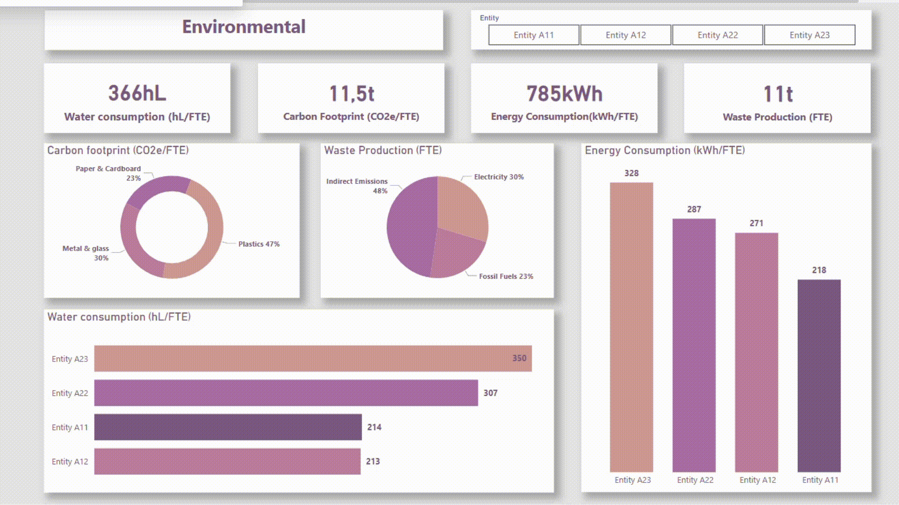
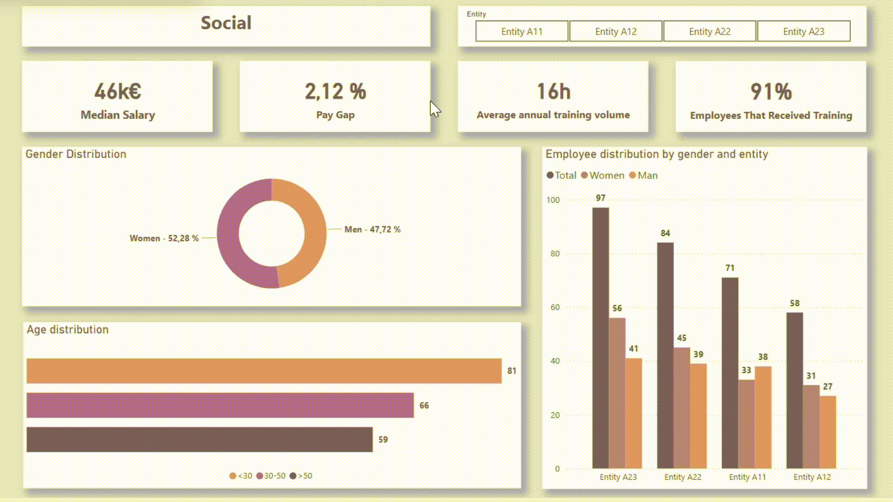

# Environmental & Social Performance Dashboard

## Overview
This project showcases an interactive Power BI dashboard developed for a commercial team to analyze and present the environmental and social performance of an organization. The dashboard provides actionable insights into key metrics across environmental and social domains, enabling stakeholders to make data-driven decisions for improvement.

The analysis is structured around two key areas:

1. **Environmental Performance**: Focused on energy, water, waste, and carbon footprint.
2. **Social Performance**: Emphasizing diversity, training, and equity metrics.

### Objectives
- Identify areas for improvement in environmental sustainability.
- Highlight regions or departments with disparities in social metrics.
- Provide a clear, interactive presentation for commercial stakeholders.

This dashboard was designed with user-friendly visuals and interactivity to enhance engagement during presentations, enabling the commercial team to present complex metrics in an easily digestible format and foster informed discussions with stakeholders.

---

## Key Components

### Power BI Dashboard
A comprehensive dashboard built to visualize and analyze data from SQL-based sources.

#### Key Features:

- **Environmental Overview:**
  Provides insights into resource consumption and environmental impact.

  


  - **Water Consumption, Carbon Footprint, Energy Consumption, Waste Production (4 Indicators):** Key metrics tracking overall environmental performance.
  - **Carbon Footprint (Donut Chart):** Displays emissions across categories (e.g., Paper & Cardboard, Plastic).
  - **Waste Production (Pie Chart):** Shows waste distribution across categories (e.g., Indirect Emissions, Electricity, Fossil Fuels).
  - **Water Consumption (Bar Chart):** Breaks down water usage across entities.
  - **Energy Consumption (Column Chart):** Tracks energy consumption across entities.


- **Social Overview:**
  Highlights key social metrics to assess workforce diversity and training efforts.

  

  - **Median Salary, Pay Gap, Average Annual Training Volume, Employees Trained (4 Indicators):** Key metrics to assess social performance.
  - **Gender Distribution (Donut Chart):** Shows gender ratio across the organization.
  - **Age Distribution (Bar Chart):** Displays employee age distribution in three categories (<30, 30-50, >50).
  - **Employee Distribution (Clustered Column Chart):** Visualizes gender distribution per entity.


#### Interactive Features:
- **Slicers:** Filter by region, time period, or department.
- **Drillthrough:** Navigate to specific details from high-level visuals.
- **Dynamic Thresholds:** Highlight entities exceeding predefined benchmarks.

---

## Key DAX Measures
These are some of the key DAX measures used to calculate essential metrics in the dashboard:

- **Employee Gender Calculation (SUM_man):** This measure calculates the total number of male employees across specific categories. It filters for relevant data points and provides the total count.

  ```DAX
  SUM_man = 
      CALCULATE(
          SUM(TAB2[COL1]), 
          TAB2[COL1] IN {"Number of men employees", "Number of men  employees"} 
      )
  ```

- **Carbon Footprint by Electricity (AVG_FOOTPRINT_electricity):** This formula calculates the sum of carbon emissions linked to electricity usage, filtered by relevant categories. It's used to assess the environmental impact of electricity consumption.

  ```DAX
   AVG_FOOTPRINT_electricity = 
      CALCULATE(
          SUM(TAB1[COL1]), 
          FILTER(
              TAB1, 
              TAB1[NAME_] = "Carbon footprint (electricity) (tC02e/FTE)" || 
              TAB1[NAME_] = "Carbon footprint (electricity)"
          )
      )
  ```

## Data Preparation

### Data Sources:
- **SQL Database:** Data extracted directly using Power BI's native SQL connector.
- **Power Query:** Used for transforming and cleaning the data.

### Data Cleaning Process:
- **Standardization:**
  - Ensured consistent formatting of numeric and categorical data.
  - Converted energy and water usage units to a uniform standard.

---
## Outcomes

### Key Insights:
- Identified high energy and water consumption areas for sustainability actions.
- Highlighted departments with low diversity ratios for improvement.
- Measured training participation to address development gaps.

### Stakeholder Impact:
- Simplified complex metrics for better understanding and discussion.
- Enhanced presentation engagement with interactive visuals.

### Challenges Overcome:
- Fixed SQL formatting issues.
- Added dynamic slicers for improved interactivity.

---

## Technologies Used
- **Power BI:** Dashboard creation, DAX calculations, and visual storytelling.
- **Power Query:** Data transformation and preparation.
- **SQL Database:** Data storage and extraction.

---

## Skills Demonstrated
- **Data Visualization:** Creating impactful and interactive dashboards.
- **Data Cleaning:** Ensuring data consistency and accuracy using Power Query.
- **DAX Proficiency:** Developing complex calculations to support advanced analytics.
- **Problem Solving:** Addressing challenges in data integration and visualization.

## Repository Structure
```plaintext
/Power-BI-Environmental-Social-Dashboard/
  ├── README.md
  ├── power-bi-dashboard/
  │     ├── screenshots/
  │         ├── environmental-overview.gif
  │         ├── social-overview.gif
```
